<p align="center"></p>

# unifi-vllm

**UniFi-Ops**: an Ollama model specialized for the **UniFi API**, part of git-fabric's **fabric-llm** layer.

It answers questions about its domain locally, so the fabric only escalates to Claude when it has to. See [fabric-sdk](https://github.com/git-fabric/sdk) for how requests are routed.

| | |
|---|---|
| Base model | `qwen2.5:14b` |
| Context window | 4,096 tokens |
| Temperature | 0.15 |
| MCP tools described | 9 |

## Use it

```bash
ollama create unifi-ops -f Modelfile
ollama run unifi-ops
```

## What's inside

A single [`Modelfile`](Modelfile): the base model, its sampling parameters, and a system prompt that teaches the model the UniFi API and the MCP tools it can call.

<!-- org-footer -->
---

<p align="center"><sub>Part of <a href="https://github.com/git-fabric">git-fabric</a> · composable fabric apps for Git-native infrastructure · built by <a href="https://github.com/ry-ops">ry-ops</a></sub></p>
